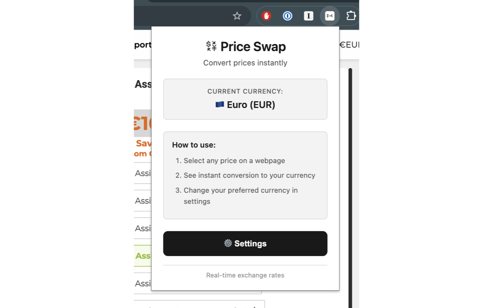
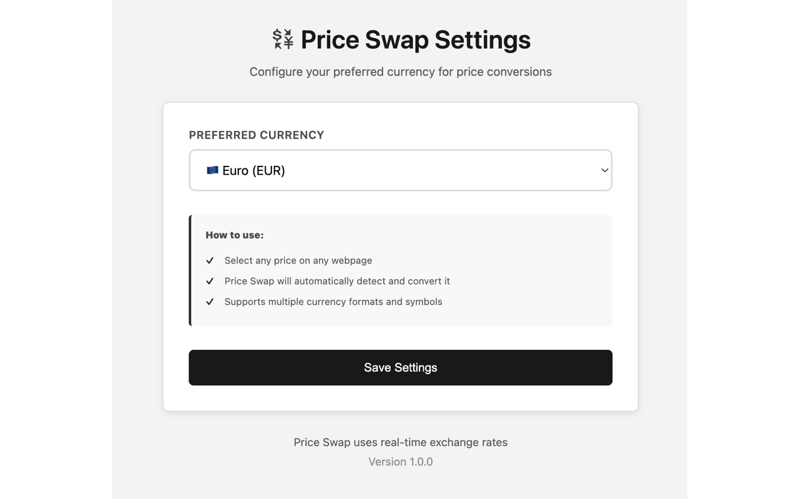
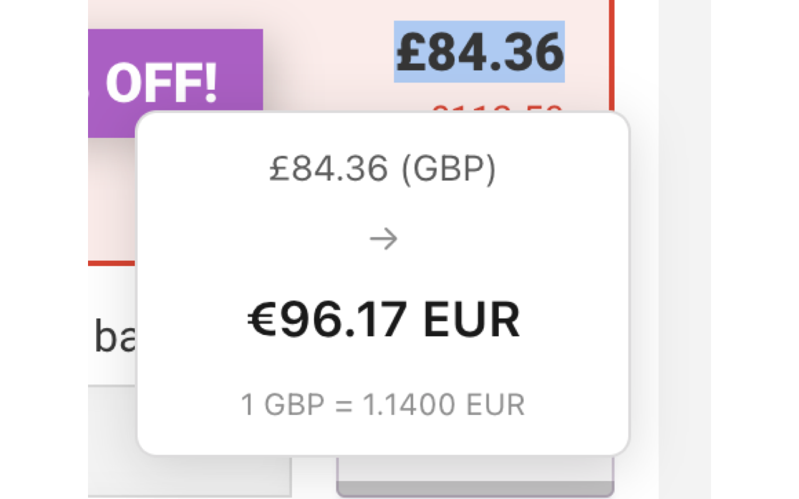

<div align="center">
  
# 💱 Price Swap

### Instant Currency Conversion for Chrome

*Select any price on any website and see it converted to your preferred currency instantly.*


</div>

---

## 🌟 Features

<table>
<tr>
<td width="50%">

### ⚡ Lightning Fast
Select any price and instantly see the conversion. No clicks, no popups, no hassle.

### 🌍 24+ Currencies
Support for all major world currencies including USD, EUR, GBP, JPY, and 20+ more.

### 🎯 Smart Detection
Automatically recognizes various price formats and currency symbols.

</td>
<td width="50%">

### 🔒 Privacy First
No data collection, no tracking. Your preferences stay on your device.

### 🎨 Minimal Design
Clean, unobtrusive interface that matches your browsing experience.

### 🌐 Works Everywhere
Compatible with all websites - shopping, travel, news, and more.

</td>
</tr>
</table>

---

## � Screenshots

<div align="center">

### Beautiful Tooltip in Action
Select any price to see instant conversion



### Simple Settings
Choose your preferred currency in seconds



### Quick Access Popup
Check your current settings anytime



</div>

---

## 🚀 Quick Start

### Installation

1. **From Chrome Web Store** (Coming Soon)
   - Visit the Chrome Web Store
   - Click "Add to Chrome"
   - Done!

2. **Manual Installation** (Developer Mode)
   ```bash
   # Clone this repository
   git clone https://github.com/YOUR_USERNAME/price-swap.git
   
   # Open Chrome and go to chrome://extensions/
   # Enable "Developer mode"
   # Click "Load unpacked"
   # Select the price-swap folder
   ```

### Usage

1. Click the extension icon and go to **Settings**
2. Select your **preferred currency**
3. Browse any website and **select any price**
4. See the **instant conversion** in a beautiful tooltip!

---

## 💰 Supported Currencies

<details>
<summary><b>View All 24 Supported Currencies</b></summary>

### Major Currencies
- 🇺🇸 **USD** - US Dollar
- 🇪🇺 **EUR** - Euro
- 🇬🇧 **GBP** - British Pound
- 🇯🇵 **JPY** - Japanese Yen
- 🇨🇦 **CAD** - Canadian Dollar
- 🇦🇺 **AUD** - Australian Dollar
- 🇨🇭 **CHF** - Swiss Franc

### European Currencies
- 🇳🇴 **NOK** - Norwegian Krone
- 🇸🇪 **SEK** - Swedish Krona
- 🇩🇰 **DKK** - Danish Krone
- 🇵🇱 **PLN** - Polish Zloty
- 🇨🇿 **CZK** - Czech Koruna
- 🇭🇺 **HUF** - Hungarian Forint
- 🇷🇴 **RON** - Romanian Leu
- 🇧🇬 **BGN** - Bulgarian Lev
- 🇭🇷 **HRK** - Croatian Kuna
- 🇮🇸 **ISK** - Icelandic Króna
- 🇹🇷 **TRY** - Turkish Lira
- 🇷🇺 **RUB** - Russian Ruble
- 🇺🇦 **UAH** - Ukrainian Hryvnia

### Other Currencies
- 🇨🇳 **CNY** - Chinese Yuan
- 🇮🇳 **INR** - Indian Rupee
- 🇲🇽 **MXN** - Mexican Peso

</details>

## Installation

### Method 1: Load Unpacked Extension (Development)

1. Open Chrome and navigate to `chrome://extensions/`
2. Enable "Developer mode" in the top right corner
3. Click "Load unpacked"
4. Select the `price-swap` folder
5. The extension should now be active!

### Method 2: Chrome Web Store (Future)
*Coming soon...*

## Usage

1. **Set Your Preferred Currency**
   - Click the Price Swap icon in your Chrome toolbar
   - Click "Settings" or right-click the icon and select "Options"
   - Choose your preferred currency from the dropdown
   - Click "Save Settings"

2. **Convert Prices**
   - Navigate to any webpage with prices
   - Select/highlight any text containing a price
   - A beautiful tooltip will appear showing the converted price
   - The tooltip disappears when you click elsewhere

---

## 🎯 Smart Features

### Intelligent Price Detection
Recognizes various price formats:
- With symbols: `$100`, `€50`, `£75`, `¥1,000`
- With codes: `100 USD`, `50 EUR`, `75 GBP`
- With formatting: `$1,234.56`, `€1.234,56`

### Domain-Based Currency Detection
Automatically detects the correct currency based on website domain:
- `.no` or `.com.no` → Norwegian Krone (NOK)
- `.se` → Swedish Krona (SEK)
- `.dk` → Danish Krone (DKK)
- And more...

### Edge Case Handling
- ✅ Handles zero-width characters
- ✅ Filters out non-price text selections
- ✅ Normalizes various number formats
- ✅ Smart caching for faster performance

---

## 🛠️ Technical Details

<details>
<summary><b>For Developers</b></summary>

### Architecture
```
┌─────────────────┐
│  Content Script │  → Monitors text selection
└────────┬────────┘
         │
         ▼
┌─────────────────┐
│ Price Detection │  → Regex pattern matching
└────────┬────────┘
         │
         ▼
┌─────────────────┐
│ Background Svc  │  → API calls & caching
└────────┬────────┘
         │
         ▼
┌─────────────────┐
│  Tooltip Display│  → Beautiful UI rendering
└─────────────────┘
```

### Technology Stack
- **Manifest V3** - Latest Chrome extension standard
- **Vanilla JavaScript** - No dependencies, maximum performance
- **Exchange Rate API** - Real-time currency data
- **Local Storage** - User preferences

### Key Files
```
price-swap/
├── manifest.json       # Extension configuration
├── background.js       # Service worker, API calls
├── content.js          # Price detection logic
├── content.css         # Tooltip styling
├── popup.html/js/css   # Extension popup
├── options.html/js/css # Settings page
└── icons/              # Extension icons
```

### Performance
- ⚡ Smart caching (1-hour TTL)
- ⚡ Lazy loading
- ⚡ Minimal DOM manipulation
- ⚡ Optimized regex patterns

</details>

---

## 🔒 Privacy & Security

<div align="center">

| What We Do | What We DON'T Do |
|------------|------------------|
| ✅ Store preferences locally | ❌ No data collection |
| ✅ Process selected text only | ❌ No tracking |
| ✅ Fetch exchange rates | ❌ No third-party sharing |
| ✅ Cache for performance | ❌ No browsing history access |

</div>

---

## 🤝 Contributing

Contributions are welcome! Here's how you can help:

1. **Report Bugs** - Open an issue with details
2. **Suggest Features** - Share your ideas
3. **Submit PRs** - Fork, code, and submit
4. **Improve Docs** - Help others understand

### Development Setup
```bash
# Clone the repo
git clone https://github.com/YOUR_USERNAME/price-swap.git

# Load in Chrome
# 1. Open chrome://extensions/
# 2. Enable "Developer mode"
# 3. Click "Load unpacked"
# 4. Select the price-swap folder
```

---

## 📝 License

MIT License - see [LICENSE](LICENSE) for details.

---

## 🌟 Support the Project

If you find Price Swap useful, please:
- ⭐ Star this repository
- 🐦 Share with others
- 🐛 Report bugs
- 💡 Suggest features

---

## 📬 Contact

Found a bug? Have a suggestion? 

- 🐛 [Open an Issue](https://github.com/YOUR_USERNAME/price-swap/issues)
- 💬 [Start a Discussion](https://github.com/YOUR_USERNAME/price-swap/discussions)

---

<div align="center">

### Made with ❤️ for international shoppers and travelers

**[Install Now](#) • [View Demo](#) • [Report Issue](https://github.com/YOUR_USERNAME/price-swap/issues)**

</div>
